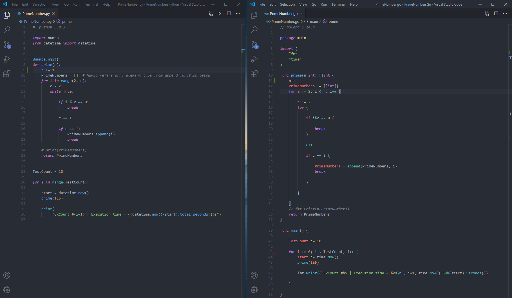
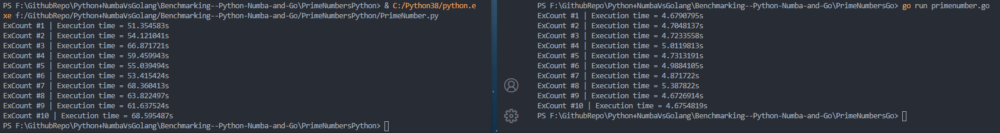
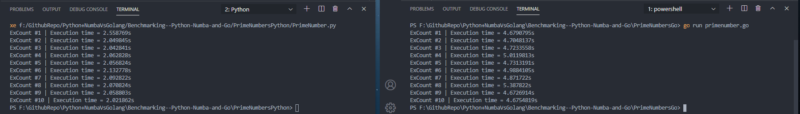

# Benchmarking: Python+Numba and Go
[computational] Benchmarking: Python+Numba and Go 

To what extent does Numba improves computational efficiency of Python!! The comparision is between two most promising languages i.e python(+Numba) and Go. The code both in Python and Go evaluates prime numbers upto a range given as input (1E5). The algorithms used in both Python and Go follow exactly same steps. The computation time is calculated for 10 iterations.

Go is certainly much faster if it's performance is compared with raw python; one of the obvious reasons could be Python being dynamically typed language wherein Go is statically typed language. 

In case Numba is used with python, the computational efficiency significantly improves. For this particular benchmarking case, it seems python+Numba is computationally ~2x faster than Go. 

**Python Version: 3.8.3,Numba version: 0.50.0, Go version:1.14.4
**Execution time could depend on system.
